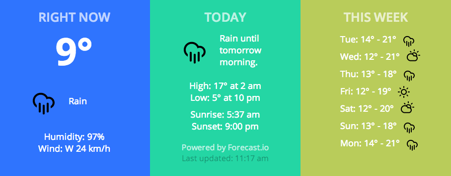

# Verbinski

A [Dashing](http://shopify.github.io/dashing/) widget that displays weather 
information from [Forecast.io](http://forecast.io/). Background changes
according to temperature (blue for cold, green for cool, orange/red for 
warm/hot, in various shades). Icons from 
[Climacons](http://adamwhitcroft.com/climacons/). 

Inspired by [Klimato](https://github.com/danillotuhumury/klimato-dashing-widget).


## Screenshot




## Setup/Requirements

### Ruby 1.9.2

Heroku requires that Sinatra applications run on Ruby 1.9.2. 

1. If you don't already have Ruby 1.9.2 installed, install it using RVM:

```bash
$ rvm install 1.9.2
```

1. Make sure that it's installed: 

```bash
$ rvm list

rvm rubies

   ruby-1.9.2-p320 [ x86_64 ]
=* ruby-1.9.3-p392 [ x86_64 ]
   ruby-2.0.0-p0 [ x86_64 ]

# => - current
# =* - current && default
#  * - default
```

1. Use Ruby 1.9.2:

```bash
$ rvm use 1.9.2
Using /Users/yiqing/.rvm/gems/ruby-1.9.2-p320
$ rvm list

rvm rubies

=> ruby-1.9.2-p320 [ x86_64 ]
 * ruby-1.9.3-p392 [ x86_64 ]
   ruby-2.0.0-p0 [ x86_64 ]

# => - current
# =* - current && default
#  * - default
```

### Create a new gemset

```bash
$ rvm gemset create verbinski
gemset created verbinski    => /Users/yiqing/.rvm/gems/ruby-1.9.2-p320@verbinski
$ rvm gemset use verbinski
Using ruby-1.9.2-p320 with gemset verbinski
```

### Install dependencies specified in Gemfile

```bash
$ bundle install
```

## Deploying to Heroku

1. Create a new Heroku app (you'll have to use something other than `verbinski`):

    $ heroku apps:create verbinski

1. Set Heroku configuration variables:

    heroku config:set FORECAST_API_KEY=myforecastapikey
    heroku config:set LATITUDE=mylatitude
    heroku config:set LONGITUDE=mylongitude

1. Deploy!

    $ git push heroku master


## Notes

1. `assets/stylesheets/application.scss` differs from the original source code
in that [line 144](https://github.com/Shopify/dashing/blob/7b2a1e7cbd4bfc7cb256b4d374906ab90ad4360c/templates/project/assets/stylesheets/application.scss#L144)
has been commented out:

    ```css
    padding: 25px 12px;
    ```

## Links

* [v2 Forecast API](https://developer.forecast.io/docs/v2)
* [Dashing](http://shopify.github.io/dashing/)
* [How To: Change the default dashboard](https://github.com/Shopify/dashing/wiki/How-To%3A-Change-the-default-dashboard)
* [How to: Deploy to Heroku](https://github.com/Shopify/dashing/wiki/How-to%3A-Deploy-to-Heroku)
* [Getting Started with Ruby on Heroku](https://devcenter.heroku.com/articles/ruby)

