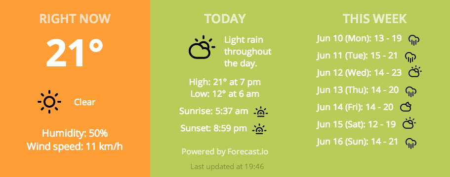

# Verbinski

A [Dashing](http://shopify.github.io/dashing/) widget that displays weather 
information from [Forecast.io](http://forecast.io/). Background changes
according to temperature (blue for cold, green for cool, orange/red for 
warm/hot). Icons from [Climacons](http://adamwhitcroft.com/climacons/). 

Inspired by [Klimato](https://github.com/danillotuhumury/klimato-dashing-widget).


## Screenshot




## Usage

1. Copy the contents of each directory to your Dashing directory. 

1. Put the following code snippet in your dashboard:

    ```html
    <li data-row="1" data-col="1" data-sizex="3" data-sizey="1">                
      <div data-id="verbinski" data-view="Verbinski"></div>                     
    </li>  
    ```


## Links

* [v2 Forecast API](https://developer.forecast.io/docs/v2)
* [Dashing](http://shopify.github.io/dashing/)

